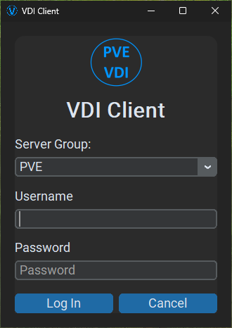
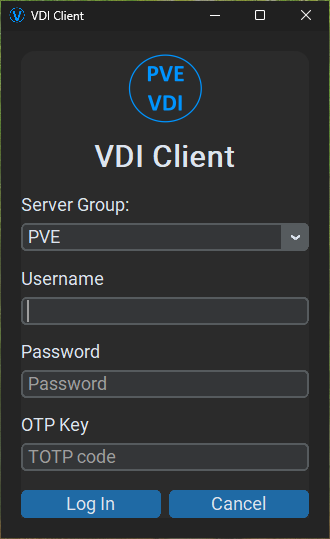
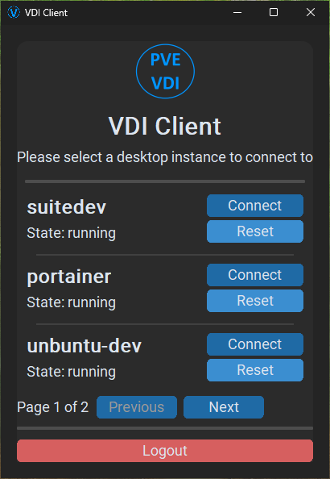

# PVE VDI Client

This project's focus is to create a simple VDI client intended for mass deployment. This VDI client connects directly to Proxmox VE and allows users to connect (via Spice) to any VMs they have permission to access.

Defining multiple Proxmox clusters is possible and can allow end users to easily select which 'server group' they wish to connect to:

## Configuration File

PVE VDI Client **REQUIRES** a configuration file to function. The client searches for this file in the following locations unless overridden with [command line options](#command-line-usage):

* Windows
    * %APPDATA%\VDIClient\vdiclient.ini
    * %PROGRAMFILES%\VDIClient\vdiclient.ini
* Linux
    * ~/.config/VDIClient/vdiclient.ini
    * /etc/vdiclient/vdiclient.ini
    * /usr/local/etc/vdiclient/vdiclient.ini

Please refer to [vdiclient.ini.example](https://github.com/joshpatten/PVE-VDIClient/blob/main/vdiclient.ini.example) for all available config file options

If you encounter any issues feel free to submit an issue report.

## Proxmox Permission Requirements

Users that are accessing VDI instances need to have the following permissions assigned for each VM they access:

* VM.PowerMgmt
* VM.Console
* VM.Audit

## Command Line Usage

No command line options are required for default behavior. The following command line options are available:

    usage: vdiclient.py [-h] [--list_themes] [--config_type {file,http}] [--config_location CONFIG_LOCATION]
                        [--config_username CONFIG_USERNAME] [--config_password CONFIG_PASSWORD] [--ignore_ssl]
    
    Proxmox VDI Client
    
    options:
      -h, --help            show this help message and exit
      --list_themes         List all available themes
      --config_type {file,http}
                            Select config type (default: file)
      --config_location CONFIG_LOCATION
                            Specify the config location (default: search for config file)
      --config_username CONFIG_USERNAME
                            HTTP basic authentication username (default: None)
      --config_password CONFIG_PASSWORD
                            HTTP basic authentication password (default: None)
      --ignore_ssl          HTTPS ignore SSL certificate errors (default: False)

If `--config_type http` is selected, pass the URL in the `--config_location` parameter

## Windows Installation

You **MUST** install virt-viewer prior to using PVE VDI client, you may download it from the [official Virtual Machine Manager](https://virt-manager.org/download.html) site.

Please visit the [releases](https://github.com/joshpatten/PVE-VDIClient/releases) section to download a prebuilt MSI package

If you need to customize the installation, such as to sign the executable and MSI, you may download and install the [WIX toolset](https://wixtoolset.org/releases/) and use the build_vdiclient.bat file to build a new MSI.

you will need to download the latest 3.12 python release, and run the following commands to install the necessary packages:

    requirements.bat

## Linux Installation

Run the following commands on a Debian/Ubuntu Linux system to install the appropriate prerequisites

    apt install python3-pip python3-tk virt-viewer git
    git clone https://github.com/joshpatten/PVE-VDIClient.git
    cd ./PVE-VDIClient/
    chmod +x requirements.sh
    ./requirements.sh
    cp vdiclient.py /usr/local/bin
    chmod +x /usr/local/bin/vdiclient.py

## Fedora/CentOS/RHEL Installation

Run the following commands on a Debian/Ubuntu Linux system to install the appropriate prerequisites

    dnf install python3-pip python3-tkinter virt-viewer git
    git clone https://github.com/joshpatten/PVE-VDIClient.git
    cd ./PVE-VDIClient/
    chmod +x requirements.sh
    ./requirements.sh
    cp vdiclient.py /usr/local/bin
    chmod +x /usr/local/bin/vdiclient.py

## Build Debian/Ubuntu Linux Binary

Run the following commands if you wish to build a binary on a Debian/Ubuntu Linux system

    apt install python3-pip python3-tk virt-viewer git
    git clone https://github.com/joshpatten/PVE-VDIClient.git
    cd ./PVE-VDIClient/
    chmod +x requirements.sh
    ./requirements.sh
    pip3 install pyinstaller
    pyinstaller --onefile --noconsole --noconfirm --hidden-import proxmoxer.backends --hidden-import proxmoxer.backends.https --hidden-import proxmoxer.backends.https.AuthenticationError --hidden-import proxmoxer.core --hidden-import proxmoxer.core.ResourceException --hidden-import subprocess.TimeoutExpired --hidden-import subprocess.CalledProcessError --hidden-import requests.exceptions --hidden-import requests.exceptions.ReadTimeout --hidden-import requests.exceptions.ConnectTimeout --hidden-import requests.exceptions.ConnectionError vdiclient.py

Once pyinstaller has finished your binary will be located in dist/vdiclient
